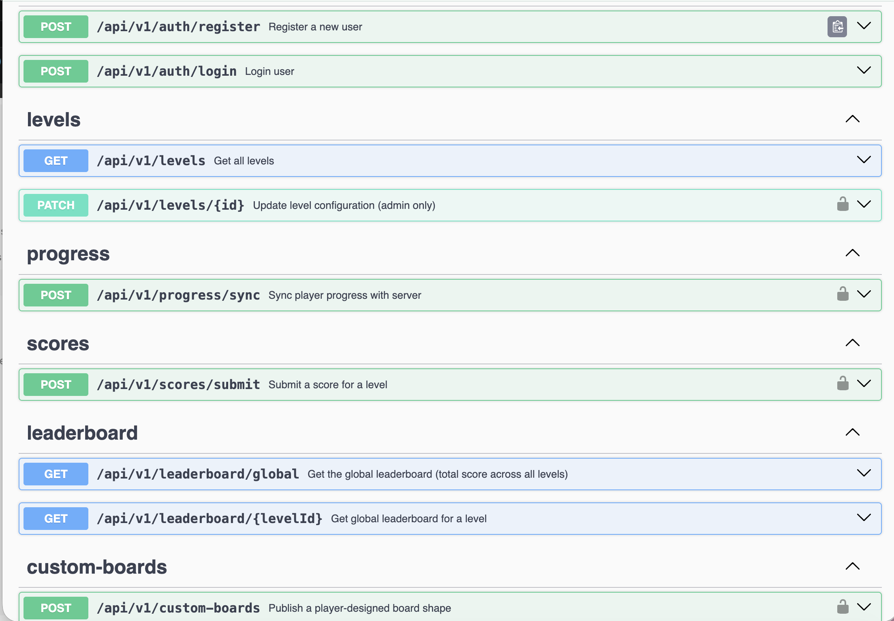
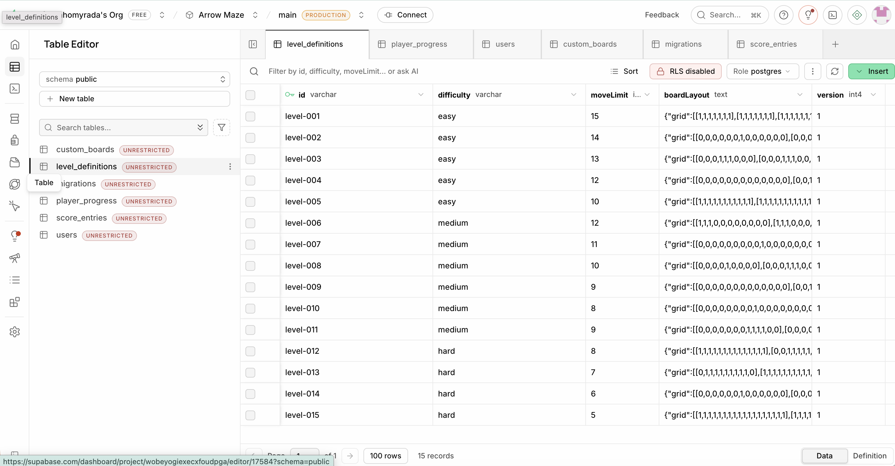
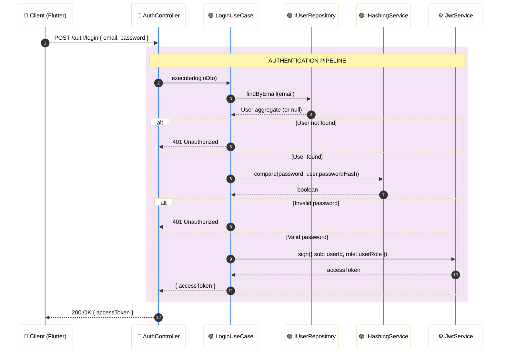
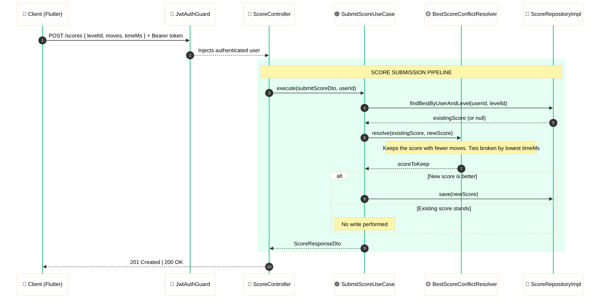

# Arrow Maze Backend - NestJS 🎮

<p align="center">
  <a href="http://nestjs.com/" target="blank">
    
  </a>
</p>

<p align="center">
  
  
  
</p>

<p align="center">
  
  
  
</p>

<p align="center">
  
  
</p>

<p align="center">
  
  
</p>

---

## 📖 Description

**Arrow Maze Backend** is the REST API powering *Arrow Maze*, a mobile puzzle game (Flutter client) where players navigate directional-arrow tiles across a grid to reach the exit within a limited number of moves. This service owns everything the game needs beyond the client-side puzzle logic:

- **Authentication** — registration and login (by email or username) with JWT access tokens.
- **Level distribution** — official level definitions, seeded on first run.
- **Community custom boards** — player-designed board layouts that authors can publish, expose author info for, and delete.
- **Score submission & leaderboards** — best-score tracking per player/level with global and per-level rankings.
- **Cross-device progress sync** — conflict resolution when a player's progress differs across devices.

Built with **NestJS** + **TypeScript**, persisted via **TypeORM** on **Supabase (PostgreSQL)**, documented with **Swagger/OpenAPI**, and structured as a 4-layer **Clean Architecture** variant defined by the course specification (see [Architecture & Design](#️-architecture--design)).

---

<div align="center">

## 🛠️ Technology Stack

| Category | Technologies |
| :--- | :--- |
| **Core Framework** | **NestJS** (Node.js) with **TypeScript** |
| **Architecture** | 4-Layer **Clean Architecture** variant (course-defined) |
| **ORM & Persistence** | **TypeORM** + **Supabase** (PostgreSQL) |
| **Authentication** | **JWT** (Access Tokens) via `@nestjs/jwt` & Passport |
| **API Documentation** | **Swagger** / OpenAPI (`@nestjs/swagger`) |
| **UML Diagrams** | **LucidChart** (full cross-layer diagram) |
| **Design Patterns** | 5 GoF patterns (Factory, Builder, Adapter, Strategy, Command) |

</div>

<br>

---

## 🛠️ Setup & Installation

### 1. Prerequisites

Make sure you have the following installed locally:

- **Node.js** v20+
- **npm** v10+
- A **Supabase** project with a connection string (no local database required)

### 2. Environment Configuration

```bash
cp .env.template .env
```

Fill in the required variables:

| Variable | Description |
| :--- | :--- |
| `DATABASE_URL` | Full Supabase connection string (found in Supabase → Project Settings → Database) |
| `JWT_SECRET` | Secret key for signing access tokens |
| `JWT_EXPIRATION` | Token TTL (e.g. `3600s`) |
| `ADMIN_SEED_PASSWORD` | Password used by the level seeder for the admin account |

### 3. Install & Run

```bash
# Install dependencies
npm install

# Development (hot-reload)
npm run start:dev

# Production build
npm run build && npm run start:prod
```

> [!TIP]
> On first run, TypeORM will sync the schema and the level seeder will populate the database automatically.

---

## 🧪 Running Tests

Tests are written with **Jest** (unit) and Jest + Supertest (e2e).

```bash
# Unit tests
npm test

# Unit tests in watch mode
npm run test:watch

# Unit tests with coverage report
npm run test:cov

# End-to-end tests (test/jest-e2e.json)
npm run test:e2e
```

---

## 📍 Access Points

Once the API is running:

| Resource | URL |
| :--- | :--- |
| **REST API** | `http://localhost:3000/api/v1` |
| **Swagger UI** | `http://localhost:3000/api/docs` |

> [!IMPORTANT]
> All protected endpoints require a `Bearer <access_token>` header. Admin-only endpoints additionally require the `admin` role encoded in the token payload. Obtain a token via `POST /api/v1/auth/login`.

<p align="center">
  
</p>

---

## 🏗️ Architecture & Design

The backend follows a **4-layer Clean Architecture** variant defined by the course specification. It incorporates Domain-Driven Design (DDD) tactical patterns (Aggregates, Value Objects, Repository interfaces), and the layering convention is dictated by the course's assignment spec and takes precedence over strict theoretical purity.

---

### 🗺️ Layer Overview

```
┌──────────────────────────────────────────────────┐
│         Layer 4 — Infrastructure                 │
│   NestJS modules, TypeORM entities, DB config,   │
│   Supabase connection, environment, seeder        │
├──────────────────────────────────────────────────┤
│         Layer 3 — Interfaces & Adapters          │
│   Controllers, RepositoryImpl, Guards, DTOs,     │
│   Mappers, Pipes, Interceptors                   │
├──────────────────────────────────────────────────┤
│         Layer 2 — Application (Use Cases)        │
│   Use case handlers, Service orchestrators,      │
│   Repository port interfaces, app DTOs           │
├──────────────────────────────────────────────────┤
│         Layer 1 — Domain                         │
│   Aggregates, Entities, Value Objects,           │
│   Domain Services, Repository port definitions   │
└──────────────────────────────────────────────────┘
```

> [!NOTE]
> `RepositoryImpl` classes reside in **Layer 3** (Interfaces & Adapters) by course design, even though they use TypeORM. This is an intentional incongruency with traditional Clean Architecture — the assignment spec takes precedence.

---

### 📂 Directory Structure

#### 🟡 Layer 1 — Domain

Pure business logic. Zero dependency on frameworks or infrastructure.

```bash
📂 src/domain/
├── 📂 aggregates/        # Aggregate roots (e.g. User, Level, Score)
├── 📂 entities/          # Domain entities with identity
├── 📂 value-objects/     # Immutable, self-validating VOs (UserId, UserRole, ArrowCell…)
├── 📂 domain-services/   # Logic spanning multiple aggregates (e.g. BestScoreConflictResolver)
└── 📂 repositories/      # Repository port interfaces (contracts only — no implementation)
```

**Key design decisions:**
- Value Object constructors are **private**. Instances are created exclusively through static factory methods (e.g. `UserRole.player()`, `UserRole.admin()`).
- Aggregates own their Value Object creation internally — no public `create()` on VOs.
- `ArrowCell` is modeled as a single object with a list of directional positions; graph nodes are cells with typed directional edges.
- Level definitions are stored as **JSON** in the database.

#### 🟣 Layer 2 — Application

Orchestrates domain logic. Contains Use Cases and application-level port interfaces.

```bash
📂 src/application/
├── 📂 use-cases/         # One handler per use case (register, login, submit-score, etc.)
├── 📂 services/          # Orchestrators that combine multiple use cases or domain services
├── 📂 ports/             # Application-level port interfaces (e.g. IHashingService)
└── 📂 dtos/              # Internal data transfer objects
```

#### 🔵 Layer 3 — Interfaces & Adapters

Bridges the outside world with the application core.

```bash
📂 src/interfaces/
├── 📂 controllers/       # NestJS route controllers
├── 📂 repositories/      # RepositoryImpl classes (TypeORM — placed here per the assignment spec)
├── 📂 guards/            # JwtAuthGuard, AdminRoleGuard
├── 📂 pipes/             # Validation pipes
├── 📂 interceptors/      # Response transformation
├── 📂 mappers/           # Domain ↔ Persistence ↔ DTO mapping
└── 📂 dtos/              # Request / Response DTOs (Swagger-annotated)
```

#### ⚙️ Layer 4 — Infrastructure

NestJS wiring, TypeORM config, and environment concerns.

```bash
📂 src/infrastructure/
├── 📂 database/          # TypeORM datasource config, TypeORM entities (ORM models)
├── 📂 modules/           # NestJS feature modules and AppModule
├── 📂 config/            # Environment validation (Joi or class-validator)
└── 📂 seeders/           # Level seeder (populates the DB on first run)
```

Persistence runs on **Supabase (PostgreSQL)**, with one table per aggregate — `users`, `level_definitions`, `player_progress`, `score_entries`, `custom_boards`, plus `migrations`:

<p align="center">
  
</p>

---

## 🧩 Design Patterns

The following **5 GoF patterns** are actually implemented in this codebase — verified against the source, not inferred. Each entry shows the real code and why it qualifies as that pattern.

### 1. Factory — `UserRole`

`src/domain/value-objects/user-role.vo.ts`

```ts
export class UserRole {
  private constructor(readonly value: string) {}

  static player(): UserRole {
    return new UserRole('player');
  }

  static admin(): UserRole {
    return new UserRole('admin');
  }

  static create(value: string): UserRole {
    const role = value.toLowerCase().trim();

    if (role !== 'player' && role !== 'admin') {
      throw new Error(`Invalid role: ${value}. Must be 'player' or 'admin'`);
    }

    return new UserRole(role);
  }

  isAdmin(): boolean {
    return this.value === 'admin';
  }
}
```

**Why this qualifies as Factory:** the constructor is `private` — the only way to obtain an instance is through the static methods (`player()`, `admin()`, `create()`), which encapsulate construction and validation logic instead of exposing it to the caller.

---

### 2. Builder — `LevelConfigBuilder`

`src/adapters/builders/level-config.builder.ts`

```ts
@Injectable()
export class LevelConfigBuilder {
  private id: string | undefined;
  private difficulty: string | undefined;
  private moveLimit: number | undefined;
  private boardLayout: string | undefined;

  setId(id: string): LevelConfigBuilder {
    this.id = id;
    return this;
  }

  setDifficulty(difficulty: string): LevelConfigBuilder {
    this.difficulty = difficulty;
    return this;
  }

  setMoveLimit(limit: number): LevelConfigBuilder {
    this.moveLimit = limit;
    return this;
  }

  setBoardLayout(json: string): LevelConfigBuilder {
    this.boardLayout = json;
    return this;
  }

  build(): LevelDefinition {
    if (!this.id) throw new Error('LevelConfigBuilder: id is required');
    if (!this.difficulty) throw new Error('LevelConfigBuilder: difficulty is required');
    if (this.moveLimit === undefined) throw new Error('LevelConfigBuilder: moveLimit is required');
    if (!this.boardLayout) throw new Error('LevelConfigBuilder: boardLayout is required');

    return LevelDefinition.create(
      LevelId.create(this.id),
      Difficulty.create(this.difficulty),
      MoveLimit.create(this.moveLimit),
      BoardLayout.create(this.boardLayout),
    );
  }

  reset(): LevelConfigBuilder {
    this.id = undefined;
    this.difficulty = undefined;
    this.moveLimit = undefined;
    this.boardLayout = undefined;
    return this;
  }
}
```

**Why this qualifies as Builder:** it constructs a complex `LevelDefinition` step by step via chainable setters (each returns `this`), separating data accumulation (`setId`, `setDifficulty`...) from the final, validated assembly (`build()`).

---

### 3. Adapter — `UserRepositoryImpl`

`src/domain/ports/user.repository.port.ts` (the port defined by the domain):

```ts
export interface IUserRepository {
  save(user: User): Promise<void>;
  findByEmail(email: Email): Promise<User | null>;
  findByUsername(username: Username): Promise<User | null>;
  findById(id: UserId): Promise<User | null>;
  existsByEmail(email: Email): Promise<boolean>;
}
```

`src/adapters/repositories/user.repository.impl.ts` (the concrete adapter):

```ts
@Injectable()
export class UserRepositoryImpl implements IUserRepository {
  constructor(
    @InjectRepository(UserEntity)
    private readonly repository: Repository<UserEntity>,
    private readonly entityMapper: UserEntityMapper,
  ) {}

  async save(user: User): Promise<void> {
    const entity = this.entityMapper.toPersistence(user);
    await this.repository.save(entity);
  }

  async findByEmail(email: Email): Promise<User | null> {
    const entity = await this.repository.findOne({
      where: { email: email.toString() },
    });
    return entity ? this.entityMapper.toDomain(entity) : null;
  }

  // findByUsername, findById, existsByEmail follow the same pattern
}
```

**Why this qualifies as Adapter:** `UserRepositoryImpl` adapts the TypeORM API (`Repository<UserEntity>`, with `.findOne()`, `.save()`, `.count()`) to satisfy the interface the domain expects (`IUserRepository`). The domain never imports TypeORM — it only knows the port.

---

### 4. Strategy — `BestScoreConflictResolver`

`src/application/ports/conflict-resolver.port.ts`:

```ts
export interface IConflictResolver {
  resolve(local: PlayerProgress, remote: PlayerProgress): PlayerProgress;
}
```

`src/adapters/services/best-score-conflict-resolver.ts`:

```ts
@Injectable()
export class BestScoreConflictResolver implements IConflictResolver {
  resolve(local: PlayerProgress, remote: PlayerProgress): PlayerProgress {
    const allLevels = new Map<string, boolean>();

    for (const level of local.getCompletedLevels()) {
      allLevels.set(level.getLevelId().toString(), true);
    }
    for (const level of remote.getCompletedLevels()) {
      allLevels.set(level.getLevelId().toString(), true);
    }

    const resolved = PlayerProgress.reconstitute(
      remote.getId(),
      remote.getUserId(),
      [],
      remote.getCoins(),
      remote.getUpdatedAt(),
    );

    for (const levelIdStr of allLevels.keys()) {
      const levelId = LevelId.create(levelIdStr);
      const localScore = local.getBestScore(levelId);
      const remoteScore = remote.getBestScore(levelId);
      const bestScore = localScore.isGreaterThan(remoteScore) ? localScore : remoteScore;
      resolved.recordCompletion(levelId, bestScore);
    }

    return resolved;
  }
}
```

**Why this qualifies as Strategy:** the conflict-resolution algorithm ("keep the best score for each level") is isolated behind `IConflictResolver`. `SyncProgressUseCase` depends only on the interface — a different strategy (e.g. "always keep the remote") could be injected without touching the use case.

---

### 5. Command — Use Case handlers

`src/application/use-cases/get-leaderboard.use-case.ts` (one of ten, all with the same shape):

```ts
@Injectable()
export class GetLeaderboardUseCase {
  constructor(
    @Inject(SCORE_REPOSITORY) private readonly scoreRepository: IScoreRepository,
    @Inject(USER_REPOSITORY) private readonly userRepository: IUserRepository,
  ) {}

  async execute(input: GetLeaderboardInput): Promise<GetLeaderboardOutput> {
    const levelId = LevelId.create(input.levelId);
    const scoreEntries = await this.scoreRepository.findTopByLevel(levelId, input.limit);

    const entries: LeaderboardEntryDTO[] = [];
    for (let rank = 0; rank < scoreEntries.length; rank++) {
      const entry = scoreEntries[rank];
      const user = await this.userRepository.findById(entry.getUserId());
      const dto = new LeaderboardEntryDTO();
      dto.rank = rank + 1;
      dto.username = user ? user.getUsername().toString() : 'Unknown';
      dto.score = entry.getScore().getValue();
      dto.achievedAt = entry.getAchievedAt().toISOString();
      entries.push(dto);
    }

    const output = new GetLeaderboardOutput();
    output.entries = entries;
    return output;
  }
}
```

**Why this qualifies as Command:** each use case packages a complete request — its dependencies injected in the constructor, plus a single entry point `execute(input)` — as a standalone object, instead of a loose function. The Controller doesn't know *how* the request is resolved, it just invokes it.

> [!NOTE]
> This Command implementation is informal: there's no shared `ICommand`/`IUseCase` interface enforcing the `execute()` contract across all use cases — it's a consistent naming convention, not a language-level contract.

</div>

---

## 🧱 SOLID Principles

Each principle is illustrated with real code from this repository, not a textbook stand-in.

### S — Single Responsibility Principle

Every use case does exactly one thing. `src/application/use-cases/submit-score.use-case.ts` only processes a score submission — it doesn't validate HTTP input, format responses, or own persistence details:

```ts
@Injectable()
export class SubmitScoreUseCase {
  constructor(
    @Inject(SCORE_REPOSITORY) private readonly scoreRepository: IScoreRepository,
    @Inject(PLAYER_PROGRESS_REPOSITORY) private readonly progressRepository: IPlayerProgressRepository,
    @Inject('LEADERBOARD_POLICY') private readonly leaderboardPolicy: LeaderboardPolicy,
  ) {}

  async execute(input: SubmitScoreInput): Promise<SubmitScoreOutput> { /* ... */ }
}
```

Every other use case (`register-user.use-case.ts`, `login-user.use-case.ts`, `sync-progress.use-case.ts`, etc.) follows the same one-handler-per-file convention.

### O — Open/Closed Principle

`IConflictResolver` (`src/application/ports/conflict-resolver.port.ts`) is the extension point; `BestScoreConflictResolver` (`src/adapters/services/best-score-conflict-resolver.ts`) is one strategy behind it:

```ts
export interface IConflictResolver {
  resolve(local: PlayerProgress, remote: PlayerProgress): PlayerProgress;
}
```

A new resolution strategy (e.g. "most recent wins") could be added as a new class implementing this interface without modifying `SyncProgressUseCase`.

### L — Liskov Substitution Principle

`IScoreRepository` (`src/domain/ports/score.repository.port.ts`) is implemented by `ScoreRepositoryImpl` (`src/adapters/repositories/score.repository.impl.ts`):

```ts
export interface IScoreRepository {
  save(entry: ScoreEntry): Promise<void>;
  findTopByLevel(levelId: LevelId, limit: number): Promise<ScoreEntry[]>;
}
```

Any class implementing `IScoreRepository` — the TypeORM-backed adapter, or an in-memory test double — is substitutable wherever the interface is consumed, with no change in caller behavior.

### I — Interface Segregation Principle

Repository ports are split **per aggregate** instead of one monolithic repository interface: `user.repository.port.ts`, `score.repository.port.ts`, `custom-board.repository.port.ts`, `level-definition.repository.port.ts`, `player-progress.repository.port.ts` — each in `src/domain/ports/`. `IUserRepository` and `IScoreRepository` share no methods, so neither consumer depends on operations it doesn't use:

```ts
export interface IUserRepository {
  save(user: User): Promise<void>;
  findByEmail(email: Email): Promise<User | null>;
  findByUsername(username: Username): Promise<User | null>;
  findById(id: UserId): Promise<User | null>;
  existsByEmail(email: Email): Promise<boolean>;
}
```

### D — Dependency Inversion Principle

Use cases depend on port abstractions and injection tokens, never on concrete adapters. The concrete binding happens in NestJS modules via custom providers, e.g. `src/infrastructure/modules/score.module.ts`:

```ts
providers: [
  SubmitScoreUseCase,
  { provide: SCORE_REPOSITORY, useClass: ScoreRepositoryImpl },
  { provide: 'LEADERBOARD_POLICY', useClass: LeaderboardPolicy },
  // ...
],
```

`SubmitScoreUseCase` only knows the token — `@Inject(SCORE_REPOSITORY) private readonly scoreRepository: IScoreRepository` — never `ScoreRepositoryImpl` directly. The same pattern binds `PASSWORD_ENCODER`, `JWT_TOKEN_PROVIDER`, and `USER_REPOSITORY` in `src/infrastructure/modules/auth.module.ts`.

---

## 🎯 AOP (Aspect-Oriented Programming)

Cross-cutting concerns are isolated from business logic in a dedicated `src/infrastructure/aop/` directory (plus `src/infrastructure/guards/`), and wired globally in `src/app.module.ts` so no controller or use case needs to know about them.

### Logging aspect — `LoggingInterceptor`

`src/infrastructure/aop/logging.interceptor.ts`, registered globally via `APP_INTERCEPTOR`:

```ts
@Injectable()
export class LoggingInterceptor implements NestInterceptor {
  intercept(context: ExecutionContext, next: CallHandler): Observable<any> {
    const request = context.switchToHttp().getRequest<Request>();
    const { method, originalUrl } = request;
    const startTime = Date.now();

    return next.handle().pipe(
      tap(() => {
        const { statusCode } = context.switchToHttp().getResponse();
        this.logger.log(`${method} ${originalUrl} - ${statusCode} - ${Date.now() - startTime}ms`);
      }),
    );
  }
}
```

### Error-handling aspect — `HttpExceptionFilter`

`src/infrastructure/aop/http-exception.filter.ts`, registered globally via `APP_FILTER`. Every unhandled or thrown exception is normalized into one consistent JSON shape (`statusCode`, `message`, `error`, `timestamp`, `path`) without any use case knowing about HTTP response formats.

### Authorization aspects — Guards

`src/infrastructure/guards/jwt-auth.guard.ts` verifies the Bearer token and attaches the decoded payload to the request; `src/infrastructure/guards/admin-role.guard.ts` then checks the role on that payload:

```ts
@Injectable()
export class AdminRoleGuard implements CanActivate {
  canActivate(context: ExecutionContext): boolean {
    // AOP Aspect: Authorization by role
    const user = (context.switchToHttp().getRequest<Request>() as any).user;
    if (!user || user.role !== 'admin') {
      throw new ForbiddenException('Admin role required');
    }
    return true;
  }
}
```

Composed on a route, each guard cross-cuts a different concern without either knowing about the other:

```ts
@Patch(':id')
@UseGuards(JwtAuthGuard, AdminRoleGuard)
async updateLevel(...) { /* ... */ }
```

**Strategy behind these aspects:** each one has a single cross-cutting responsibility (SRP) and is registered through NestJS extension points (`APP_INTERCEPTOR`, `APP_FILTER`, `@UseGuards`) rather than by modifying the classes it applies to (OCP) — the same two principles called out directly in the source comments of `logging.interceptor.ts` and `http-exception.filter.ts`.

> [!NOTE]
> **Honest gap:** DTOs use `class-validator` decorators (e.g. `@IsEmail()`, `@MinLength()` in `src/adapters/dtos/register.request.dto.ts`), but no `ValidationPipe` is registered — neither globally in `main.ts` nor per-route. These decorators are currently inert. Wiring `app.useGlobalPipes(new ValidationPipe())` in `main.ts` is a straightforward follow-up. There are also no custom parameter decorators (e.g. `@CurrentUser()`) yet — the `user` payload is read directly off the request object inside guards/controllers.

---

## 🔐 Auth Flow



---

## 📊 Score Submission Flow



> [!WARNING]
> **Score Integrity — Known Limitation:** Score values are trusted as-is from the client. The server performs no server-side replay or move validation. See the [Known Limitations](#️-known-limitations--future-work) section for documented mitigations.

---

## 📡 API Endpoints

A complete interactive reference is available in **Swagger UI** at `http://localhost:3000/api/docs` once the API is running.

<div align="center">

### Auth

| Method | Endpoint | Auth | Description |
| :--- | :--- | :--- | :--- |
| `POST` | `/api/v1/auth/register` | Public | Register a new player account |
| `POST` | `/api/v1/auth/login` | Public | Authenticate and receive a JWT |

### Levels

| Method | Endpoint | Auth | Description |
| :--- | :--- | :--- | :--- |
| `GET` | `/api/v1/levels` | Public | List all available levels |
| `GET` | `/api/v1/levels/:id` | Public | Get a single level definition |
| `POST` | `/api/v1/levels` | Admin | Create a new level |
| `PATCH` | `/api/v1/levels/:id` | Admin | Update a level definition |
| `DELETE` | `/api/v1/levels/:id` | Admin | Delete a level |

### Scores

| Method | Endpoint | Auth | Description |
| :--- | :--- | :--- | :--- |
| `POST` | `/api/v1/scores` | Player | Submit a completed level score |
| `GET` | `/api/v1/scores/me` | Player | Get authenticated player's score history |

### Leaderboard

| Method | Endpoint | Auth | Description |
| :--- | :--- | :--- | :--- |
| `GET` | `/api/v1/leaderboard` | Public | Global leaderboard (best score per player per level) |
| `GET` | `/api/v1/leaderboard/:levelId` | Public | Level-specific leaderboard |

</div>

---

## 📁 UML Diagrams

The complete cross-layer UML diagram (Domain, Application, Interfaces & Adapters, Infrastructure) is maintained in LucidChart:

➡️ **[View the complete UML diagram in LucidChart](https://lucid.app/lucidchart/49e45929-96c3-4110-ba7c-fbd1bca7bcc4/edit?invitationId=inv_9170294c-6f82-42ae-8a50-dbbf83af8d13&page=1Igc6LC-rTiJ#)**

| Scope | Contents |
| :--- | :--- |
| Domain (Layer 1) | Aggregates, Entities, Value Objects, Repository interfaces |
| Application (Layer 2) | Use Cases, Service interfaces, Application ports |
| Interfaces & Adapters (Layer 3) | Controllers, RepositoryImpl, Guards, Mappers |
| Infrastructure (Layer 4) | TypeORM entities, NestJS modules, DB config |

---

## ⚠️ Known Limitations / Future Work

These limitations are documented deliberately. They represent trade-offs accepted within the academic project scope and are candidates for hardening in a production context.

### 🔓 1. Client-Trusted Scores

**Current behavior:** The `SubmitScoreUseCase` trusts the `moves` and `timeMs` values received from the Flutter client without server-side verification.

**Risk:** A malicious client can submit arbitrarily low scores and top the leaderboard.

**Proposed mitigations (not implemented):**

- **HMAC signing** — Client signs the score payload with a shared secret; server verifies the signature before persistence.
- **Server-side replay** — Store the full move sequence and re-execute it server-side to derive the canonical score.
- **Score floor/ceiling limits** — Reject scores statistically outside the feasible range (e.g. `moves < minimumPossibleMoves` for a given level).

### 🌐 2. Global Leaderboard Only

**Current behavior:** The leaderboard is global; there is no friends list, regional ranking, or time-windowed leaderboard (e.g. weekly).

**Future work:** Introduce leaderboard segments and a `TimeWindow` Value Object to scope ranking queries.

### 🔄 3. No Token Refresh

**Current behavior:** Only short-lived access tokens are issued. There is no refresh token flow.

**Future work:** Implement a `RefreshToken` entity and a `POST /auth/refresh` endpoint following the rotation pattern.

### 🎮 4. Game Logic is Fully Client-Side

**By design:** The Flutter client runs all Arrow Maze solving logic. The backend is purely a data and auth layer.

**Trade-off:** This simplifies the backend considerably but means the server cannot independently validate whether a level was legitimately solved.

---

## 🔗 Related Resources

> [!IMPORTANT]
> **API Specification (Swagger)**
> For full endpoint contracts, request/response schemas, and authentication examples, run the stack and navigate to:
>
> 📂 `http://localhost:3000/api/docs`

---

## 🤖 AI Usage Documentation

This project was developed with significant AI assistance, documented transparently as required by the course (Section 7). See **[AI_USAGE.md](AI_USAGE.md)** for the full record: tools and models used, per-task usage log, approximate percentage of AI-assisted code, cases where the AI produced incorrect results and how they were detected and corrected, and the team's reflection on productivity and code quality.

---

## 🤝 Contributing

### Commit Convention

This repository follows **[Conventional Commits](https://www.conventionalcommits.org/)**: `type(scope): description`, e.g.:

```
feat(backend): add community custom boards (player-designed shapes)
fix(backend): stop JWT tokens from expiring 1 second after login
docs(backend): add layer architecture diagrams
chore(backend): update dependencies after npm install
```

Common types: `feat`, `fix`, `docs`, `chore`, `refactor`, `test`.

### Branching & Workflow

- **`main`** — stable, deployable branch.
- **`develop`** — integration branch; feature and fix branches merge here first.

Workflow: branch off `develop` (e.g. `feat/short-description`), commit using the convention above, then open a pull request back into `develop`. `develop` is merged into `main` for releases.

### Pull Requests

- Keep PRs scoped to a single feature or fix.
- Ensure `npm run lint` and `npm test` pass before requesting review.
- Describe *why* the change is needed, not just what changed — the diff already shows what changed.

---

## 📄 License

This project is **`UNLICENSED`** (see `package.json`), developed as part of an academic course assignment. All rights reserved — not intended for redistribution or external reuse.
