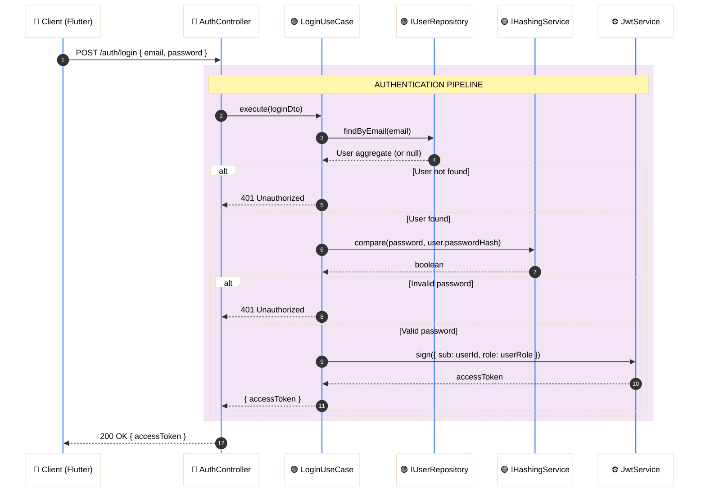
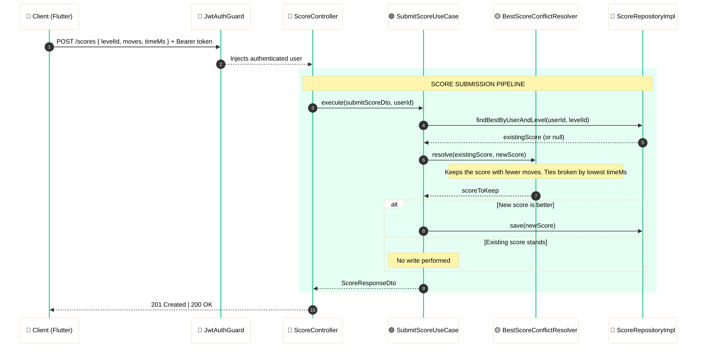

# Arrow Maze Backend - NestJS 🎮

<p align="center">
  <a href="http://nestjs.com/" target="blank">
    
  </a>
</p>

<p align="center">
  
  
  
</p>

<p align="center">
  
  
  
</p>

<p align="center">
  
  
</p>

---

<div align="center">

## 🛠️ Technology Stack

| Category | Technologies |
| :--- | :--- |
| **Core Framework** | **NestJS** (Node.js) with **TypeScript** |
| **Architecture** | 4-Layer **Clean Architecture** variant (course-defined) |
| **ORM & Persistence** | **TypeORM** + **Supabase** (PostgreSQL) |
| **Authentication** | **JWT** (Access Tokens) via `@nestjs/jwt` & Passport |
| **API Documentation** | **Swagger** / OpenAPI (`@nestjs/swagger`) |
| **UML Diagrams** | **LucidChart** (full cross-layer diagram) |
| **Design Patterns** | 5 GoF patterns (Factory, Builder, Adapter, Strategy, Command) |

</div>

<br>

---

## 🛠️ Setup & Installation

### 1. Prerequisites

Make sure you have the following installed locally:

- **Node.js** v20+
- **npm** v10+
- A **Supabase** project with a connection string (no local database required)

### 2. Environment Configuration

```bash
cp .env.template .env
```

Fill in the required variables:

| Variable | Description |
| :--- | :--- |
| `DATABASE_URL` | Full Supabase connection string (found in Supabase → Project Settings → Database) |
| `JWT_SECRET` | Secret key for signing access tokens |
| `JWT_EXPIRATION` | Token TTL (e.g. `3600s`) |
| `ADMIN_SEED_PASSWORD` | Password used by the level seeder for the admin account |

### 3. Install & Run

```bash
# Install dependencies
npm install

# Development (hot-reload)
npm run start:dev

# Production build
npm run build && npm run start:prod
```

> [!TIP]
> On first run, TypeORM will sync the schema and the level seeder will populate the database automatically.

---

## 📍 Access Points

Once the API is running:

| Resource | URL |
| :--- | :--- |
| **REST API** | `http://localhost:3000/api/v1` |
| **Swagger UI** | `http://localhost:3000/api/docs` |

> [!IMPORTANT]
> All protected endpoints require a `Bearer <access_token>` header. Admin-only endpoints additionally require the `admin` role encoded in the token payload. Obtain a token via `POST /api/v1/auth/login`.

---

## 🏗️ Architecture & Design

The backend follows a **4-layer Clean Architecture** variant defined by the course specification. It incorporates Domain-Driven Design (DDD) tactical patterns (Aggregates, Value Objects, Repository interfaces), and the layering convention is dictated by the academic assignment (*enunciado*) and takes precedence over strict theoretical purity.

---

### 🗺️ Layer Overview

```
┌──────────────────────────────────────────────────┐
│         Layer 4 — Infrastructure                 │
│   NestJS modules, TypeORM entities, DB config,   │
│   Supabase connection, environment, seeder        │
├──────────────────────────────────────────────────┤
│         Layer 3 — Interfaces & Adapters          │
│   Controllers, RepositoryImpl, Guards, DTOs,     │
│   Mappers, Pipes, Interceptors                   │
├──────────────────────────────────────────────────┤
│         Layer 2 — Application (Use Cases)        │
│   Use case handlers, Service orchestrators,      │
│   Repository port interfaces, app DTOs           │
├──────────────────────────────────────────────────┤
│         Layer 1 — Domain                         │
│   Aggregates, Entities, Value Objects,           │
│   Domain Services, Repository port definitions   │
└──────────────────────────────────────────────────┘
```

> [!NOTE]
> `RepositoryImpl` classes reside in **Layer 3** (Interfaces & Adapters) by course design, even though they use TypeORM. This is an intentional incongruency with traditional Clean Architecture — the enunciado takes precedence.

---

### 📂 Directory Structure

#### 🟡 Layer 1 — Domain

Pure business logic. Zero dependency on frameworks or infrastructure.

```bash
📂 src/domain/
├── 📂 aggregates/        # Aggregate roots (e.g. User, Level, Score)
├── 📂 entities/          # Domain entities with identity
├── 📂 value-objects/     # Immutable, self-validating VOs (UserId, UserRole, ArrowCell…)
├── 📂 domain-services/   # Logic spanning multiple aggregates (e.g. BestScoreConflictResolver)
└── 📂 repositories/      # Repository port interfaces (contracts only — no implementation)
```

**Key design decisions:**
- Value Object constructors are **private**. Instances are created exclusively through static factory methods (e.g. `UserRole.player()`, `UserRole.admin()`).
- Aggregates own their Value Object creation internally — no public `create()` on VOs.
- `ArrowCell` is modeled as a single object with a list of directional positions; graph nodes are cells with typed directional edges.
- Level definitions are stored as **JSON** in the database.

#### 🟣 Layer 2 — Application

Orchestrates domain logic. Contains Use Cases and application-level port interfaces.

```bash
📂 src/application/
├── 📂 use-cases/         # One handler per use case (register, login, submit-score, etc.)
├── 📂 services/          # Orchestrators that combine multiple use cases or domain services
├── 📂 ports/             # Application-level port interfaces (e.g. IHashingService)
└── 📂 dtos/              # Internal data transfer objects
```

#### 🔵 Layer 3 — Interfaces & Adapters

Bridges the outside world with the application core.

```bash
📂 src/interfaces/
├── 📂 controllers/       # NestJS route controllers
├── 📂 repositories/      # RepositoryImpl classes (TypeORM — placed here per enunciado)
├── 📂 guards/            # JwtAuthGuard, AdminRoleGuard
├── 📂 pipes/             # Validation pipes
├── 📂 interceptors/      # Response transformation
├── 📂 mappers/           # Domain ↔ Persistence ↔ DTO mapping
└── 📂 dtos/              # Request / Response DTOs (Swagger-annotated)
```

#### ⚙️ Layer 4 — Infrastructure

NestJS wiring, TypeORM config, and environment concerns.

```bash
📂 src/infrastructure/
├── 📂 database/          # TypeORM datasource config, TypeORM entities (ORM models)
├── 📂 modules/           # NestJS feature modules and AppModule
├── 📂 config/            # Environment validation (Joi or class-validator)
└── 📂 seeders/           # Level seeder (populates the DB on first run)
```

---

## 🧩 Design Patterns

The following **5 GoF patterns** are implemented in this codebase. Each is listed with its concrete location and purpose.

<div align="center">

| Pattern | Category | Location | Purpose |
| :--- | :--- | :--- | :--- |
| **Factory** | Creational | `UserRole.player()` / `.admin()` / `.create()` (`src/domain/value-objects/user-role.vo.ts`) | Encapsulates Value Object instantiation behind semantic static methods; constructor is private |
| **Builder** | Creational | `LevelConfigBuilder` (`src/adapters/builders/level-config.builder.ts`) | Constructs a `LevelDefinition` step-by-step via chainable setters and `build()` |
| **Adapter** | Structural | `RepositoryImpl` classes (Layer 3, e.g. `UserRepositoryImpl`) | Wraps TypeORM `Repository<Entity>` APIs behind domain repository port interfaces |
| **Strategy** | Behavioral | `BestScoreConflictResolver implements IConflictResolver` | Pluggable algorithm for resolving score conflicts when syncing player progress |
| **Command** | Behavioral | Use case handler objects (one per use case, each exposing `execute()`) | Encapsulates a request as an object with a uniform entry point |

</div>

---

## 🔐 Auth Flow



---

## 📊 Score Submission Flow



> [!WARNING]
> **Score Integrity — Known Limitation:** Score values are trusted as-is from the client. The server performs no server-side replay or move validation. See the [Known Limitations](#️-known-limitations--future-work) section for documented mitigations.

---

## 📡 API Endpoints

A complete interactive reference is available in **Swagger UI** at `http://localhost:3000/api/docs` once the API is running.

<div align="center">

### Auth

| Method | Endpoint | Auth | Description |
| :--- | :--- | :--- | :--- |
| `POST` | `/api/v1/auth/register` | Public | Register a new player account |
| `POST` | `/api/v1/auth/login` | Public | Authenticate and receive a JWT |

### Levels

| Method | Endpoint | Auth | Description |
| :--- | :--- | :--- | :--- |
| `GET` | `/api/v1/levels` | Public | List all available levels |
| `GET` | `/api/v1/levels/:id` | Public | Get a single level definition |
| `POST` | `/api/v1/levels` | Admin | Create a new level |
| `PATCH` | `/api/v1/levels/:id` | Admin | Update a level definition |
| `DELETE` | `/api/v1/levels/:id` | Admin | Delete a level |

### Scores

| Method | Endpoint | Auth | Description |
| :--- | :--- | :--- | :--- |
| `POST` | `/api/v1/scores` | Player | Submit a completed level score |
| `GET` | `/api/v1/scores/me` | Player | Get authenticated player's score history |

### Leaderboard

| Method | Endpoint | Auth | Description |
| :--- | :--- | :--- | :--- |
| `GET` | `/api/v1/leaderboard` | Public | Global leaderboard (best score per player per level) |
| `GET` | `/api/v1/leaderboard/:levelId` | Public | Level-specific leaderboard |

</div>

---

## 📁 UML Diagrams

The complete cross-layer UML diagram (Domain, Application, Interfaces & Adapters, Infrastructure) is maintained in LucidChart:

➡️ **[View the complete UML diagram in LucidChart](https://lucid.app/lucidchart/49e45929-96c3-4110-ba7c-fbd1bca7bcc4/edit?invitationId=inv_9170294c-6f82-42ae-8a50-dbbf83af8d13&page=1Igc6LC-rTiJ#)**

| Scope | Contents |
| :--- | :--- |
| Domain (Layer 1) | Aggregates, Entities, Value Objects, Repository interfaces |
| Application (Layer 2) | Use Cases, Service interfaces, Application ports |
| Interfaces & Adapters (Layer 3) | Controllers, RepositoryImpl, Guards, Mappers |
| Infrastructure (Layer 4) | TypeORM entities, NestJS modules, DB config |

---

## ⚠️ Known Limitations / Future Work

These limitations are documented deliberately. They represent trade-offs accepted within the academic project scope and are candidates for hardening in a production context.

### 🔓 1. Client-Trusted Scores

**Current behavior:** The `SubmitScoreUseCase` trusts the `moves` and `timeMs` values received from the Flutter client without server-side verification.

**Risk:** A malicious client can submit arbitrarily low scores and top the leaderboard.

**Proposed mitigations (not implemented):**

- **HMAC signing** — Client signs the score payload with a shared secret; server verifies the signature before persistence.
- **Server-side replay** — Store the full move sequence and re-execute it server-side to derive the canonical score.
- **Score floor/ceiling limits** — Reject scores statistically outside the feasible range (e.g. `moves < minimumPossibleMoves` for a given level).

### 🌐 2. Global Leaderboard Only

**Current behavior:** The leaderboard is global; there is no friends list, regional ranking, or time-windowed leaderboard (e.g. weekly).

**Future work:** Introduce leaderboard segments and a `TimeWindow` Value Object to scope ranking queries.

### 🔄 3. No Token Refresh

**Current behavior:** Only short-lived access tokens are issued. There is no refresh token flow.

**Future work:** Implement a `RefreshToken` entity and a `POST /auth/refresh` endpoint following the rotation pattern.

### 🎮 4. Game Logic is Fully Client-Side

**By design:** The Flutter client runs all Arrow Maze solving logic. The backend is purely a data and auth layer.

**Trade-off:** This simplifies the backend considerably but means the server cannot independently validate whether a level was legitimately solved.

---

## 🔗 Related Resources

> [!IMPORTANT]
> **API Specification (Swagger)**
> For full endpoint contracts, request/response schemas, and authentication examples, run the stack and navigate to:
>
> 📂 `http://localhost:3000/api/docs`
